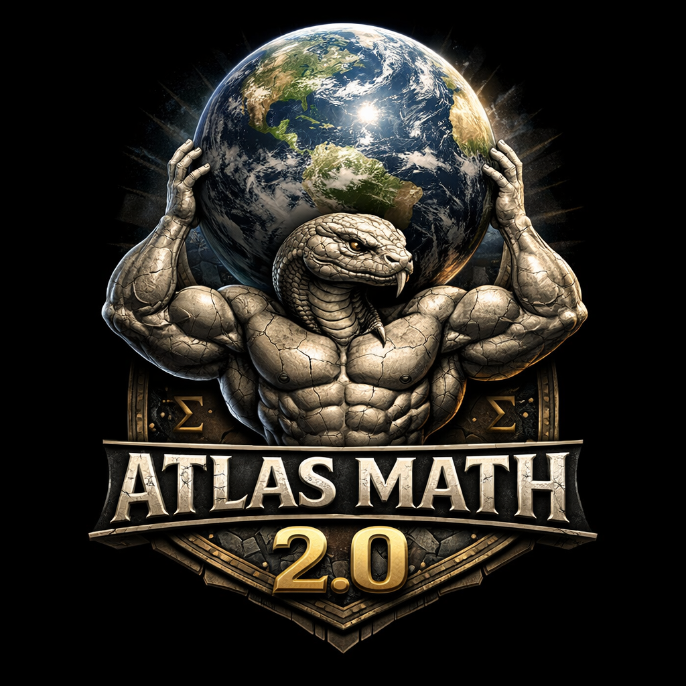

---
language:
- en
license: mit
task_categories:
- text-generation
- question-answering
pretty_name: Atlas Math Sets
size_categories:
- 10M<n<100M
configs:
- config_name: default
  data_files:
  - split: train
    path: data/train.jsonl
  - split: validation
    path: data/validation.jsonl
  - split: test
    path: data/test.jsonl
---

<p align="center">
  
</p>

# Atlas Math Sets

Atlas Math Sets is the companion Hugging Face dataset for the Atlas Math generation toolkit. It is a large-scale synthetic mathematics dataset designed for instruction-style training, controlled dataset construction, and experiments where **final unique record count matters**.

The dataset is generated from a registry of math modules spanning multiple topics and difficulty levels. Unlike a simple template dump, Atlas Math is built around configurable post-generation deduplication, structured generation when modules support it, and retry logic that aims for a requested number of **unique final records** after filtering duplicates.

## What makes this dataset distinct

Atlas Math Sets is designed around **controlled uniqueness**.

During generation, the builder can target a requested final unique dataset size, measure observed unique yield, retry underfilled buckets, and stop once the build reaches the requested target within a tolerance window. This makes the dataset useful for:

- instruction tuning
- synthetic data scaling studies
- curriculum learning
- duplicate-sensitive evaluation
- dataset generation benchmarking

The toolkit supports three uniqueness policies during post-hoc deduplication:

- `input_answer`: records are duplicates when normalized `input` and normalized `answer` match
- `input_only`: records are duplicates when normalized `input` matches
- `full`: records are duplicates only when the full serialized record matches

In practice, this means Atlas Math Sets can be built to reflect different notions of “the same problem,” depending on whether you want to collapse equivalent equation-answer pairs, collapse repeated prompts entirely, or preserve metadata-rich variants.

## Dataset Summary

Each row is a structured math instruction example. Depending on export format and source module, examples may include only compact training fields or richer metadata.

Common fields include:

- `instruction`: natural-language prompt
- `input`: math expression, equation, or structured problem text
- `answer`: canonical final answer string
- `answer_words`: verbalized answer string
- `difficulty`: difficulty label such as `level_1`
- `topic`: top-level content area such as algebra or geometry
- `subtopic`: finer-grained generator category
- `output`: rendered computation or formatted result string in some dataset variants

The current public dataset is intended to support short-form answer generation and formatted math task prompting.

## Supported Tasks

This dataset is suitable for:

- math instruction tuning
- short-form answer generation
- equation solving
- symbolic manipulation
- curriculum-style filtering by difficulty
- synthetic evaluation under controlled deduplication settings

## Languages

- English

## Dataset Structure

### Data Instances

A compact example in the style of the provided sample:

```json
{
  "instruction": "Solve the multi-step equation 3y + -4 = 8 - 0.",
  "input": "3y + -4 = 8 - 0",
  "answer": "4",
  "answer_words": "four",
  "difficulty": "level_1"
}
```

Another common Atlas Math style includes a rendered `output` field:

```json
{
  "instruction": "Sum up 98296 + 65243",
  "input": "98296 + 65243",
  "output": "98296 + 65243 = 163539",
  "answer": "163539"
}
```

### Data Fields

#### `instruction`

Natural-language task prompt presented to the model.

Examples:

```text
Solve the multi-step equation 3y + -4 = 8 - 0.
Sum up 98296 + 65243
```

#### `input`

Structured math problem text, equation, or expression.

Examples:

```text
3y + -4 = 8 - 0
98296 + 65243
```

#### `answer`

Canonical short answer string. This is the field most suitable for exact-match evaluation.

Examples:

```text
4
163539
```

#### `answer_words`

Optional verbalized answer representation.

Example:

```text
four
```

#### `difficulty`

Generator-assigned difficulty band.

Example:

```text
level_1
```

#### `topic`

Optional top-level topic label such as:

- algebra
- prealgebra
- geometry
- trigonometry
- statistics
- calculus

#### `subtopic`

Optional finer-grained generator label describing the module family that produced the sample.

#### `output`

Optional rendered result string, useful when training models to emit formatted computations instead of only final answers.

Example:

```text
98296 + 65243 = 163539
```

## Example Records

```json
{"instruction": "Solve the multi-step equation 3y + -4 = 8 - 0.", "input": "3y + -4 = 8 - 0", "answer": "4", "answer_words": "four", "difficulty": "level_1"}
{"instruction": "Solve the multi-step equation 3x + 3 = 13 - -2.", "input": "3x + 3 = 13 - -2", "answer": "4", "answer_words": "four", "difficulty": "level_1"}
{"instruction": "Find the solution to -3x + 7 = 39 - -1.", "input": "-3x + 7 = 39 - -1", "answer": "-11", "answer_words": "minus eleven", "difficulty": "level_1"}
{"instruction": "Solve the multi-step equation -2y + 0 = 28 - 8.", "input": "-2y + 0 = 28 - 8", "answer": "-10", "answer_words": "minus ten", "difficulty": "level_1"}
{"instruction": "Find the solution to -2y + 9 = -3 - -4.", "input": "-2y + 9 = -3 - -4", "answer": "4", "answer_words": "four", "difficulty": "level_1"}
```

## Splits

The standard dataset card layout assumes:

- `train`
- `validation`
- `test`

If your published dataset uses different filenames or additional configs, update the YAML `configs` block accordingly.

## Dataset Creation

### Source Data

Atlas Math Sets is generated programmatically with the Atlas Math toolkit.

The underlying codebase uses a registry of topic-organized generator modules. Modules can produce data in multiple ways:

- random generation
- structured generation
- unique iteration interfaces such as `generate_unique`, `iter_unique`, or `iter_samples` when available

When structured interfaces are available, the builder can use them directly. Otherwise, it falls back to randomized generation.

### Generation Process

A typical build pipeline works like this:

1. discover enabled generator modules from the registry
2. resolve selected topics, subtopics, modules, and difficulty levels
3. allocate generation targets across module and difficulty buckets
4. generate raw samples
5. apply post-hoc deduplication
6. measure observed unique yield
7. retry underfilled buckets when needed
8. stop when the build reaches the requested target within tolerance or no longer grows meaningfully

This makes the final dataset a product of both raw sample generation and deduplication policy.

### Uniqueness and Deduplication

A central feature of Atlas Math Sets is configurable uniqueness.

The builder can be instructed to aim for a requested number of **unique final records after deduplication**, not merely a raw number of generated samples. The exposed deduplication modes are:

- `input_answer`
- `input_only`
- `full`

These modes correspond to different uniqueness definitions:

- `input_answer`: collapse repeated problem/answer pairs
- `input_only`: collapse repeated problem inputs regardless of metadata or phrasing differences
- `full`: keep distinct serialized records unless every field matches

The generator also tracks unique yield across rounds and can estimate how much additional raw generation is needed when a build falls short of the requested unique target.

### Curation Rationale

Atlas Math Sets is designed for researchers and builders who need:

- scalable synthetic math data
- topic-aware and difficulty-aware generation
- multiple output schemas
- control over effective dataset diversity
- reproducible dataset construction workflows

A major motivation is to avoid treating raw synthetic sample count as equivalent to useful dataset size. In many math generation settings, near-duplicates can distort both training dynamics and evaluation metrics. Atlas Math therefore emphasizes uniqueness control as a first-class part of dataset creation.

## Source Code Topics

The Atlas Math generator library spans six top-level topic families:

- algebra
- prealgebra
- geometry
- trigonometry
- statistics
- calculus

Within those topics, modules cover finer-grained tasks such as equations, inequalities, transformations, measurement, identities, interpretation, and other structured math skills.

## Intended Uses

### Direct Use

Recommended uses include:

- supervised fine-tuning for math instruction following
- training compact answer generators
- training formatted-output generators
- curriculum learning by difficulty band
- synthetic data ablations
- deduplication-sensitive dataset experiments
- probing generalization across math topic families

### Out-of-Scope Use

This dataset should not be treated as:

- a substitute for real student-authored tutoring data
- a comprehensive benchmark for advanced theorem-level reasoning
- a faithful model of natural classroom language
- a standalone measure of general mathematical intelligence

## Limitations

- The dataset is synthetic and may not reflect real learner phrasing, mistakes, or tutoring dialogue.
- Difficulty labels are generator-defined and may not perfectly align with human judgments of difficulty.
- Effective dataset diversity depends on the selected deduplication mode.
- Strong performance on structured equation-style prompts may not transfer to broader mathematical reasoning.
- Some variants emphasize concise final answers rather than full reasoning traces.

## Bias, Risks, and Safety

Atlas Math Sets is lower risk than open-domain web corpora, but there are still important caveats:

- Synthetic distributions may underrepresent messy, ambiguous, or naturally expressed problems.
- Models trained heavily on templated math prompts may overfit to formatting regularities.
- Evaluation on synthetic tasks can overstate real-world educational usefulness.
- Deduplication choices can materially affect downstream results and should be reported when publishing experiments.

## Recommended Evaluation

Useful metrics include:

- exact match on `answer`
- normalized exact match after sign and whitespace normalization
- accuracy by `difficulty`
- accuracy by `topic` and `subtopic`
- robustness under different deduplication settings
- agreement between concise `answer` and formatted `output`, when both exist

## Loading the Dataset

### Hugging Face Datasets

```python
from datasets import load_dataset

ds = load_dataset("AtlasUnified/atlas-math-sets")
print(ds)
print(ds["train"][0])
```

### Streaming

```python
from datasets import load_dataset

stream = load_dataset("AtlasUnified/atlas-math-sets", split="train", streaming=True)
first = next(iter(stream))
print(first)
```

### Local JSONL Files

```python
from datasets import load_dataset

dataset = load_dataset(
    "json",
    data_files={
        "train": "data/train.jsonl",
        "validation": "data/validation.jsonl",
        "test": "data/test.jsonl",
    },
)
print(dataset)
```

## Prompting Example

```python
example = {
    "instruction": "Solve the multi-step equation 2x + -3 = 14 - -1.",
    "input": "2x + -3 = 14 - -1",
    "answer": "9",
    "answer_words": "nine",
    "difficulty": "level_1"
}

prompt = f"Instruction: {example['instruction']}\\nInput: {example['input']}\\nAnswer:"
print(prompt)
```

## Suggested Repository Layout

```text
atlas-math-sets/
├── README.md
├── data/
│   ├── train.jsonl
│   ├── validation.jsonl
│   └── test.jsonl
└── LICENSE
```

## Citation

If you use Atlas Math Sets, cite the dataset page or the associated Atlas Math repository.

```bibtex
@dataset{atlas_math_sets,
  title  = {Atlas Math Sets},
  author = {AtlasUnified},
  year   = {2026},
  note   = {Synthetic mathematics dataset with configurable uniqueness and deduplication-aware generation}
}
```

## License

MIT
